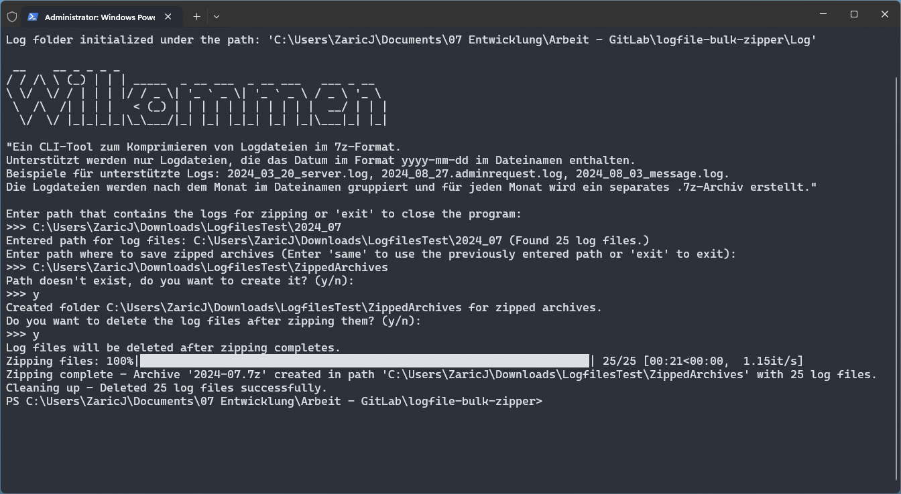
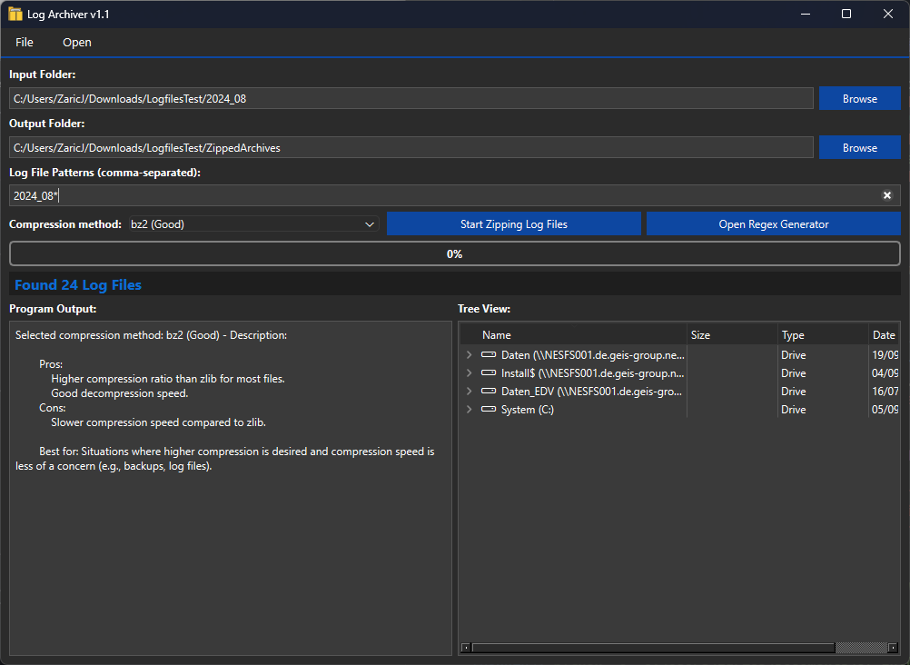

# Log File Zipping Tool
Dieses Python-Skript ist ein Kommandozeilen-Tool (CLI) zum Komprimieren von Logdateien im 7z-Format. Es unterstützt nur Logdateien, deren Dateinamen ein Datum im Format `yyyy_mm_dd` enthalten, wie z.B. `2024_03_20_server.log`. Das Skript gruppiert die Logdateien nach dem Monat im Dateinamen und erstellt für jeden Monat ein separates `.7z`-Archiv.

## Funktionsweise

- Das Skript durchsucht ein angegebenes Verzeichnis nach Logdateien und komprimiert diese zu `.7z`-Archiven.
- Die Logdateien werden nach dem Datum im Dateinamen (Jahr und Monat) gruppiert.
- Es wird für jeden Monat ein Archiv erstellt, das alle zugehörigen Logdateien enthält.
- Es besteht die Möglichkeit, die ursprünglichen Logdateien nach der Komprimierung zu löschen.

## Voraussetzungen

- Python 3.6 oder höher
- Abhängigkeiten: `tqdm` (für den Fortschrittsbalken)

## Installation

1. Python 3.6 oder höher installiern.
2. Python Package `tqdm` installieren:

   ```bash
   pip install tqdm
   ```

## Verwendung

1. Skript im Terminal/CMD ausführen:
   ```bash
   python LogfileZipper.py
   ```

2. Befolge die Eingabeaufforderungen:
   - **Logs-Verzeichnis**: Pfad des Verzeichnisses, das die zu komprimierenden Logdateien enthält.
   - **Zielverzeichnis**: Pfad, wo die komprimierten Archive gespeichert werden sollen (kann das gleiche Verzeichnis wie das Logs-Verzeichnis sein).
   - **Löschen der Logdateien**: Entscheidung, ob die Original-Logdateien nach der Komprimierung gelöscht werden sollen.

3. Das Skript zeigt den Fortschritt beim Komprimieren und die Protokollierung in der Konsole an. Die Protokolldateien werden unter `Log/zipping_history.log` gespeichert.

## Beispiele für unterstützte Logdateien

- `2024_03_20_server.log`
- `2024_08_27.adminrequest.log`
- `2024_08_03_message.log`

## Protokollierung

Das Skript erstellt ein Protokollverzeichnis (`log`) und speichert alle Aktivitäten in der Datei `zipping_history.log`. Es werden sowohl Fehler als auch Informationen zur Ausführung des Skripts protokolliert.

## Windows Executable Binary

Eine GUI version von dem Skript gibt es unter dem Releases.

Direkter download link: [Download LogfileZipper](https://git.de.geis-group.net/-/project/646/uploads/421d41b3658aeab2280b28933334f031/LogfileZipperGUI.7z)

## Fehlerbehebung

- Stelle sicher, dass die eingegebenen Verzeichnispfade existieren und gültig sind.
- Überprüfe die Berechtigungen zum Erstellen von Dateien und Verzeichnissen.
- Wenn das Skript keine Logdateien findet, überprüfe, ob die Dateinamen dem Format `yyyy_mm_dd` entsprechen.

## Screenshots und GIFs

### CLI Screenshot



### GUI Screenshot



### GUI Demo GIF


